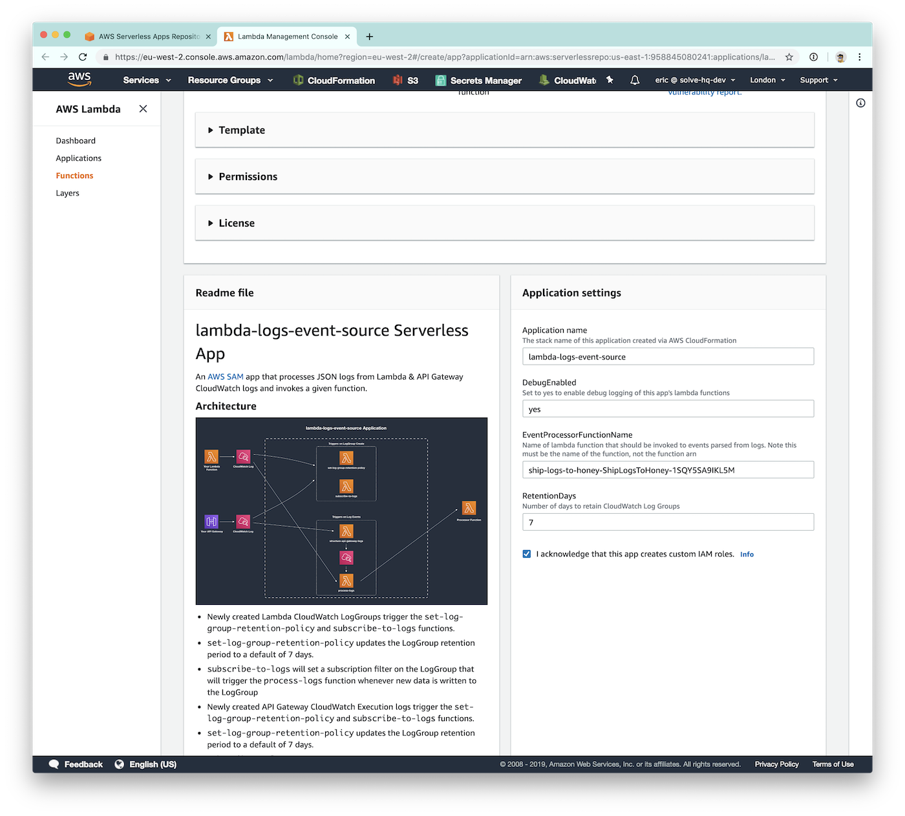

# lambda-logs-event-source Serverless App

An [AWS SAM](https://github.com/awslabs/serverless-application-model) app that processes JSON logs from Lambda & API Gateway CloudWatch logs and invokes a given function.

## Architecture


- Newly created Lambda CloudWatch LogGroups trigger the `set-log-group-retention-policy` and `subscribe-to-logs` functions.
- `set-log-group-retention-policy` updates the LogGroup retention period to a default of 7 days.
- `subscribe-to-logs` will set a subscription filter on the LogGroup that will trigger the `process-logs` function whenever new data is written to the LogGroup
- Newly created API Gateway CloudWatch Execution logs trigger the `set-log-group-retention-policy` and `subscribe-to-logs` functions.
- `set-log-group-retention-policy` updates the LogGroup retention period to a default of 7 days.
- `subscribe-to-logs` will set a subscription filter on the LogGroup that will trigger the `structure-api-gateway-logs` function whenever new data is written to the LogGroup
- `structure-api-gateway-logs` will parse the logs produced by API Gateway and write structured JSON to its own LogGroup
- The `structure-api-gateway-logs` has a subscription filter on it that triggers the `process-logs`.
- `process-logs` parses the structured JSON logs into individual events and invokes your Processor Function with an array of events using an `"Event"` invocation type

## Usage

This app is meant to be used as part of a parent application, so the recommended way to use it is to embed it as a nested app in your serverless application. To do this, paste the following into your SAM template:

```yaml
LogSource:
  Type: AWS::Serverless::Application
  Properties:
    Location:
      ApplicationId: arn:aws:serverlessrepo:us-east-1:958845080241:applications/lambda-logs-event-source
      SemanticVersion: 1.0.0
    Parameters:
      EventProcessorFunctionName: !Ref ShipLogsToThirdParty
      # Retention Period in Days of LogGroups
      #RetentionDays: 60 # Uncomment to override default value
      # Enable debug logging in the lambda-logs-event-source lambda functions
      #DebugEnabled: "yes" # Uncomment to override default value
```

> **Note:** The above method only works if the parent application deploys to `us-east-1`. See the instructions below for an alternative method

### Usage in non us-east-1 region

Because of limitations of the Serverless Application Repository (SAR), if you'd like to deploy this stack to a non `us-east-1` region you cannot use the `AWS::Serverless::Application` resource type in a parent application and deploy the parent application.

Instead, you'll need to deploy the parent application with the `AWS::Serverless::Application` resource, and use the SAR Console to deploy the public `lambda-logs-event-source` application, inputting the `EventProcessorFunctionName` function name in the UI.

That means that before you can deploy this stack, you'll need to deploy the parent stack and make note of the function name of the lambda that will be handling the log events. Then, follow the steps below to deploy this stack:

1. Find the `lambda-logs-event-source` application in the Available Applications section of the SAR or simply [visit the public page of the application here](https://serverlessrepo.aws.amazon.com/applications/arn:aws:serverlessrepo:us-east-1:958845080241:applications~lambda-logs-event-source) and hit the "Deploy" button


2. Fill out the parameters, making sure to use the lambda function name (not ARN) of the lambda in the parent stack that will be handling the logs events:



3. Complete the process by ensuring the "I Acknowledge that this app creates IAM roles" is checked and then hit the "Deploy" button
